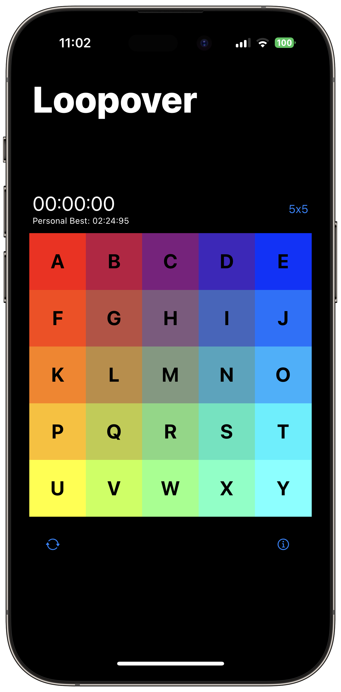
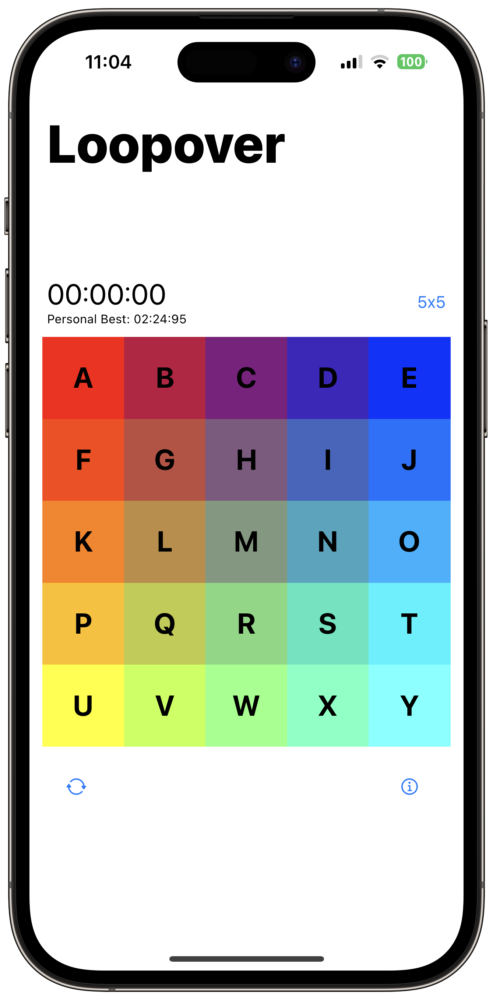
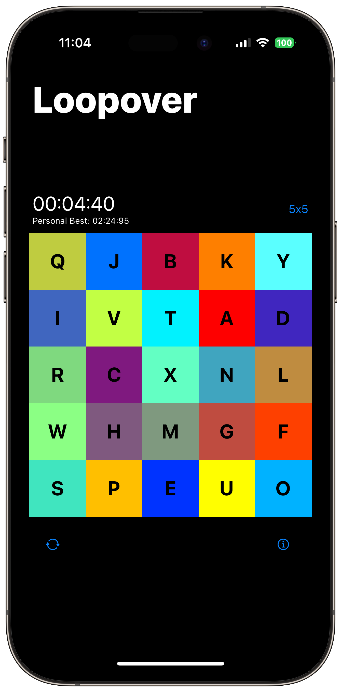

# Loopover

Loopover is a challenging 2D Rubix Cube style puzzle game. The goal of the game is to slide every box back into its original place. Any box that goes outside the grid will "loopover" back around to the other side. The game can be played in 4 different sizes: 3x3, 4x4, 5x5, and 6x6. Try to come up with the fastest time for each board!

  
  <!-- 
   -->

## Attribution
Loopover is a recreation of Cary Huang's [Loopover](https://openprocessing.org/sketch/580366/) written in Processing. We wanted to take the amazing concept of this game and make it more mobile friendly with native swipe gestures, using local storage to save user's best scores, and allowing for offline play. Please check out the original!

[ConfettiSwiftUI](https://github.com/simibac/ConfettiSwiftUI) by simibac

